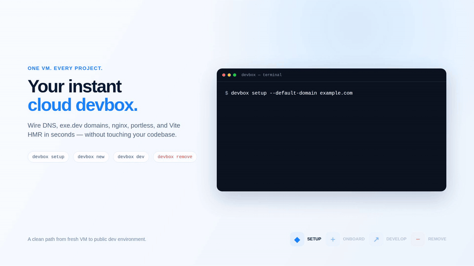

# devbox

A CLI that automates bringing up an [exe.dev](https://exe.dev) VM for multi-project development behind an **nginx + portless** reverse proxy. It wires per-project public subdomains to your VM, handles DNS, and fixes Vite HMR through the proxy — so a fresh VM goes from zero to serving real traffic in minutes.

## Demo



*15-second tour of `devbox setup`, `new`, `dev`, and `remove`*

## What it does

**1. One-time VM bring-up** — `devbox setup`

- Installs Node.js (LTS), portless, and nginx
- Starts the shared portless daemon on `:8888`
- Writes nginx config under `~/.devbox/nginx` (the system nginx loads it via a one-time include shim)
- Discovers the VM's name + default port from exe.dev reflection
- Runs health checks (`devbox doctor`)

**2. Per-project domain onboarding** — `devbox new`

- Detects the DNS provider of the apex (Cloudflare / manual)
- Adds the `CNAME → <vm>.exe.xyz` (via Cloudflare API automatically via the exe.dev proxy, or via `$CLOUDFLARE_API_TOKEN`, else prints manual instructions)
- Registers the domain with exe.dev (automatically if an API token is set, else prints the command to run)
- Writes the nginx server block and reloads
- **Smart defaults**: if a `--default-domain` was set during setup, just pass the project name and the FQDN is derived (`devbox new groot` → `groot.nesin.io`).

**3. HMR-aware dev launching** — `devbox dev`

- Sets `VITE_HMR_URL` to the project's public domain so WebSocket HMR works through exe.dev + nginx
- Kills leftover dev processes holding the `*.localhost` route name
- Runs detached with logs to `~/.devbox/state/<project>-dev.log`

## Install

**From release binary** (recommended — no Go needed):

```bash
curl -sfL https://raw.githubusercontent.com/AshikNesin/exe-devbox/main/install.sh | bash
```

**From source** (requires Go 1.26+):

```bash
git clone https://github.com/AshikNesin/exe-devbox.git
cd devbox
make install   # builds to ~/.local/bin/devbox + installs bash completion
```

## Quick start

```bash
# 1. Bring the VM up (idempotent — safe to re-run)
devbox setup --default-domain example.com

# 2. Wire a public domain to a project on this VM
devbox new myapp         # derives myapp.example.com from --default-domain
# or: devbox new -d myapp.example.com

# 3. Launch the dev server with correct HMR env
devbox dev myapp

# 4. Check everything is live
devbox status
```

## Commands

| Command | Description |
| --- | --- |
| `devbox setup` | Install deps, configure nginx, discover VM identity |
| `devbox new -d <fqdn>` | Onboard a project domain (DNS + exe.dev + nginx route) |
| `devbox dev [project]` | Launch a portless dev server with HMR env |
| `devbox status` | Show VM identity, proxy state, domain liveness, portless routes |
| `devbox doctor` | Run health checks (reflection, deps, services, ports) |
| `devbox nginx` | Manage the devbox-managed nginx config (show/edit/reload) |
| `devbox set-token` | Store an exe.dev API token for auto domain registration |
| `devbox update` | Self-update to the latest GitHub release (`--check` to just check) |

### Global flags

| Flag | Description |
| --- | --- |
| `--config <dir>` | Config dir (default `~/.devbox`) |
| `--json` | Machine-readable JSON output |
| `--yes` | Skip confirmation prompts |
| `-v, --verbose` | Verbose output |

## How it works

```
Browser ──HTTPS──▶ exe.dev proxy ──▶ nginx (:8080)
                                      │  server_name routing
                                      ▼
                                 portless (:8888)
                                      │  <project>.localhost
                                      ▼
                               project dev server
```

- **nginx** listens on the VM's default proxy port and routes by `Host` (each project gets its own `server` block).
- **portless** is the local reverse proxy that maps `<project>.localhost` to whichever dev server registered that route.
- **Custom domains** CNAME to `<vm>.exe.xyz` (which resolves), **not** `<vm>.exe.dev` (which doesn't).

### Config directory

```
~/.devbox/
├── config.json          # VM identity + ports (cached)
├── nginx/conf.d/
│   ├── 00-devbox-base.conf   # WS upgrade map + catch-all 404
│   └── <project>.conf        # one server block per project
├── bin/
└── state/
    ├── domains.json         # registered domains + projects
    └── <project>-dev.log    # detached dev server logs
```

## DNS providers

`devbox new` detects the apex's provider and acts accordingly:

- **Cloudflare** — automatic via the exe.dev Cloudflare integration (no token needed — credentials injected by the network-edge proxy, discovered at runtime from reflection). Or set `$CLOUDFLARE_API_TOKEN` (needs `Zone.DNS Edit` + `Zone.Read`) for direct API access.
- **Manual** — prints the exact CNAME record to add at your registrar.

## exe.dev domain registration

`devbox new` registers each domain with exe.dev (the `domain add` step). Two modes:

- **Automatic** — store a scoped exe.dev API token and devbox calls `domain add` directly. Setup is two steps:

  **On your local machine** (where `ssh exe.dev` works), generate a token scoped to **only** `domain add` and `domain remove`:
  ```bash
  ssh exe.dev ssh-key generate-api-key --cmds="domain add,domain remove" --exp=never --label=devbox
  ```

  **On the VM**, store it:
  ```bash
  devbox set-token exe0.eyJjbW...paste-token-here...
  ```

  Now `devbox new -d app.example.com` registers the domain automatically — zero manual steps.

- **Manual** — without a token, devbox prints the exact `ssh exe.dev domain add …` command to paste at [https://exe.dev/shell](https://exe.dev/shell).

## Requirements

- An [exe.dev](https://exe.dev) VM
- Go 1.26+ (to build)
- `sudo` (for nginx/portless install + the `/etc/nginx/conf.d/devbox.conf` include shim)

## Project structure

```
cmd/devbox/          # CLI entrypoint + cobra command tree
  main.go
  cmds/              # one file per command
internal/
  cloudflare/        # Cloudflare API CNAME management
  config/            # ~/.devbox paths + state files
  deps/              # node/portless/nginx installers
  dns/               # apex detection + provider classification
  exeapi/            # exe.dev HTTPS API (domain add)
  nginx/             # nginx config rendering + reload
  notify/            # push notifications via exe.dev notify integration
  output/            # colored/JSON output helpers
  portless/          # portless daemon management
  reflection/        # exe.dev VM identity discovery
  system/            # OS probes + sudo wrapper
.github/workflows/   # CI: release.yml builds + publishes on tag push
CHANGELOG.md         # release notes (Keep a Changelog format)
docs/PRD.md          # product requirements + design notes
```

## License

MIT
